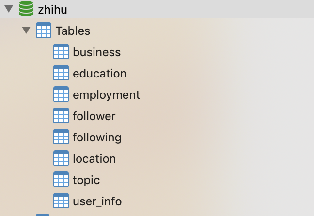
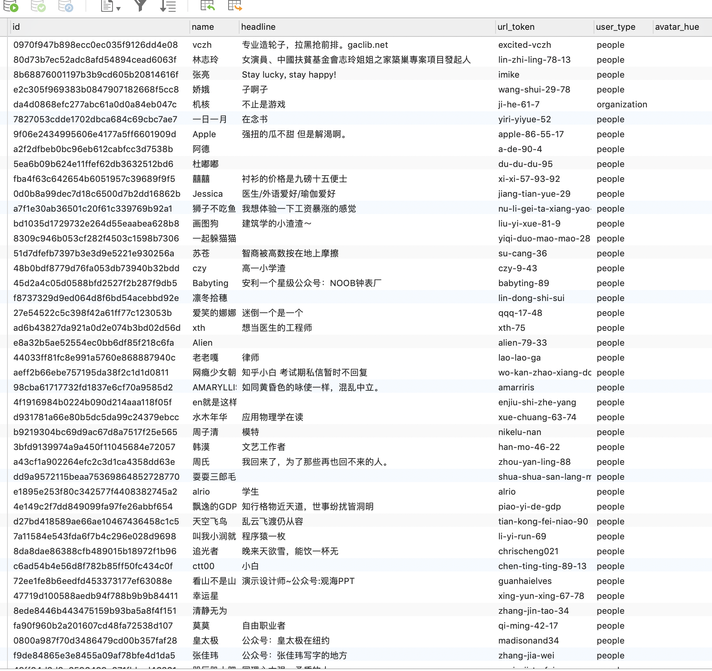
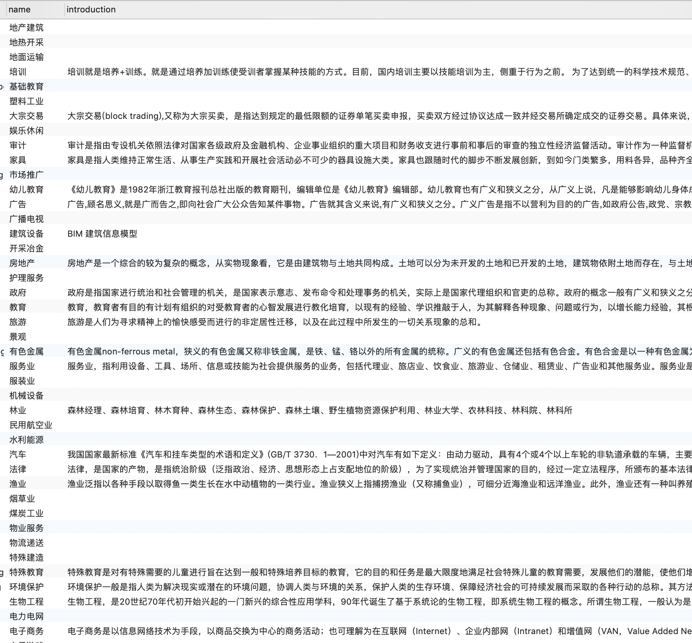
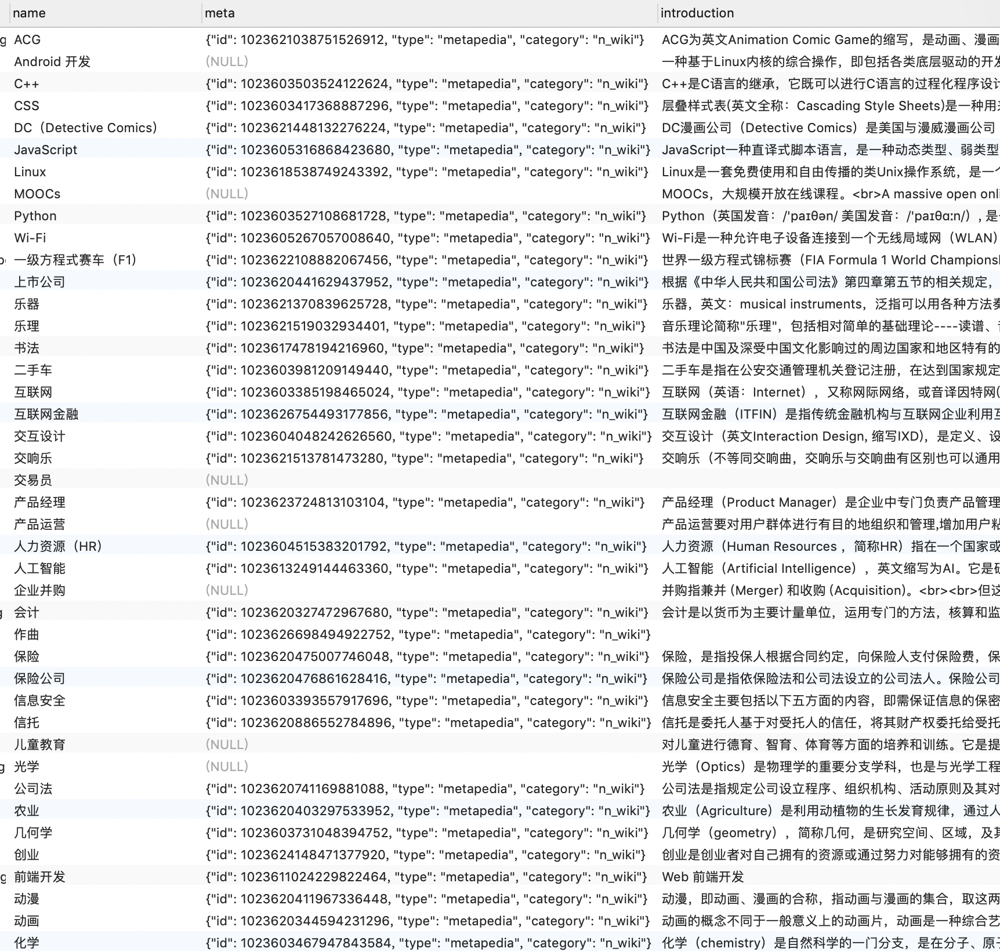
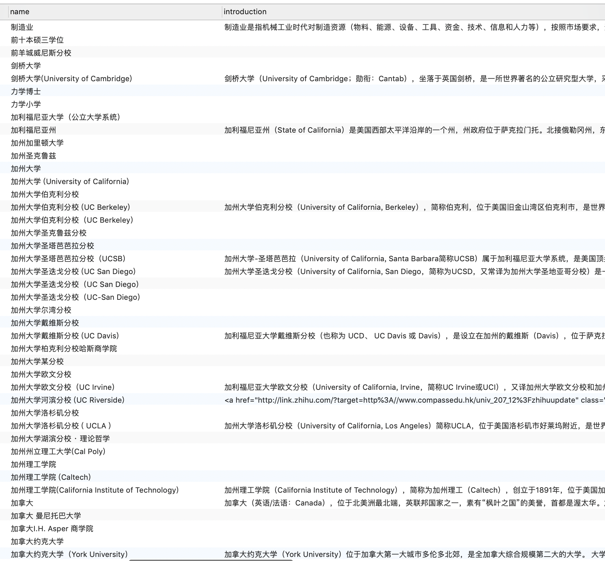
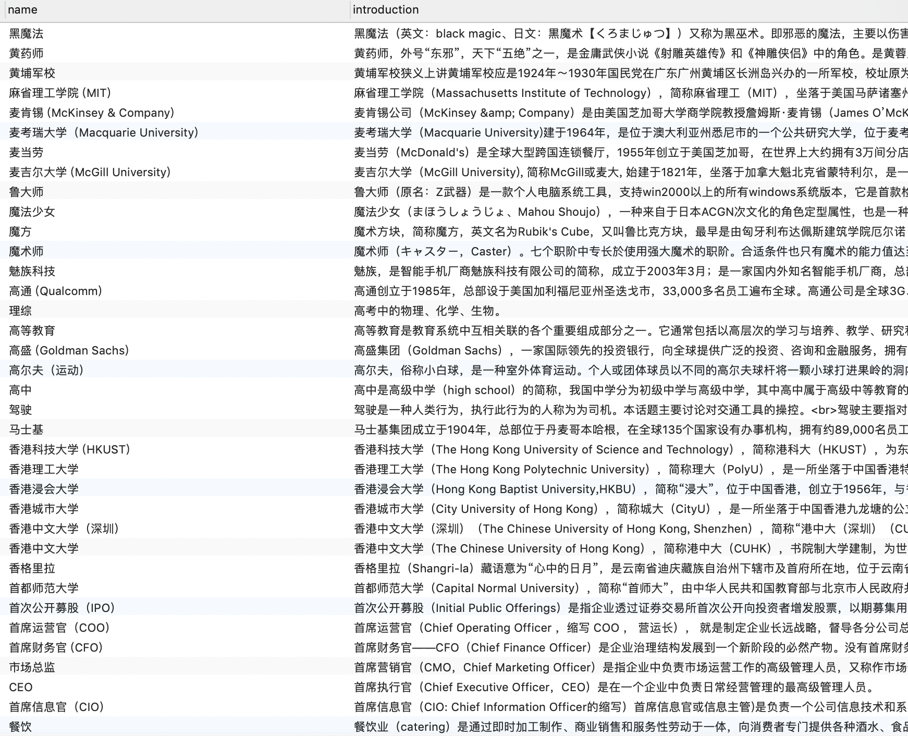
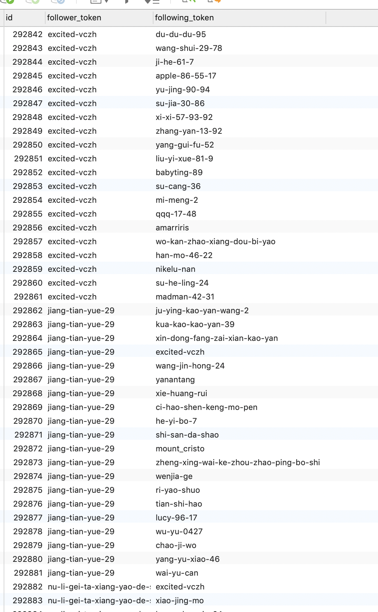

### 知乎爬虫
#### 简介
1. 项目主要为爬取知乎用户以及知乎关注被关注的关系网，数据库使用MySQL，分为八个表，如下图   
    
   
        
2. 表中相关字段可参照 zhihu_spider/items.py 中的字段进行一一比对，在此不在赘述。
3. 爬虫核心主要依靠知乎用户信息api和用户关注api进行字段拆解
4. 由于知乎反爬限制，需要自行配置代理，配置代理方式有很多种，不配置代理的话请加大延迟时间
5. 代码用于个人测试和学习，请遵守相关法律法规，请谨慎对待用户信息。

#### 使用方式
 1. 安装MySQL 教程不在此赘述，新建数据库并将 zhihu.sql建表文件导入数据库 并在 all_secret_set.py中配置好数据库相关项
 2. 安装scrapy以及相关依赖 `pip install -r requirements.txt`
 3. 运行main.py
 4. start.sh 用于服务器部署，请自行修改适应自己运行环境

#### 部分内容图片展示

- 用户信息
    
    
- 公司信息
    

- 话题信息
     
    
- 教育信息
    
     
- 工作信息
    
    
- 关注信息
    
    
- 地区信息
    